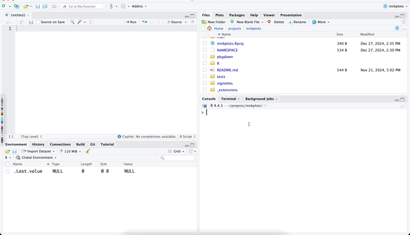

```{r, include = FALSE}
knitr::opts_chunk$set(
  collapse = TRUE,
  comment = "#>"
)

library(mnbplots)
```

The `use_slide` function in the `mnbplots` package allows you to create PowerPoint slide templates using Quarto. This function is designed to streamline the process of generating new slide files from predefined templates, making it easier to maintain consistency across your presentations.

To use the `use_slide` function, you need to specify the filename for the new slide and the template you want to use. By default, the filename is set to "slide" and the template is set to "mnb100". You can customize these parameters to fit your specific needs. For example, you can create a new slide file named "presentation" using the "custom_template" by calling `use_slide("presentation", "mnb100")`.



The function works by first checking if the specified template exists in the package's template directory. If the template is available, it creates a new directory called "\_extensions" (if it doesn't already exist) and copies the template file into this directory. The new slide file is then created with the specified filename and the ".qmd" extension. Currently, **mnb100** is the only available template!

If the template is not found, the function will abort and display an error message indicating that the template should be one of the available templates. This ensures that you are always using valid templates and helps prevent errors in your presentation creation process.

Overall, the `use_slide` function is a powerful tool for anyone looking to create consistent and professional PowerPoint presentations using Quarto and the `mnbplots` package. By automating the template selection and file creation process, it saves you time and effort, allowing you to focus on the content of your slides.